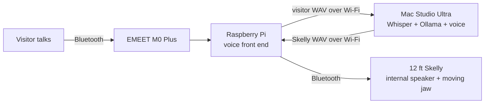
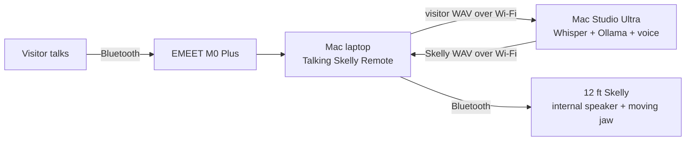

# Talking Skelly

A local, hands-free Halloween conversation system with three deployment choices.

## Choose a deployment

### Talking Skelly — standalone Mac

The original configuration. The Bluetooth microphone and Skelly Live speaker connect directly to the Mac. The Mac records, transcribes, thinks, creates the voice, and plays it through Skelly.

1. Use DecorPro SVI on your phone to open **Customize → Live**.
2. Pair `Skelly (Live)` with the Mac using PIN **1234**.
3. Select the remote microphone under macOS **Sound → Input**.
4. Select `Skelly (Live)` under macOS **Sound → Output**.
5. Open **Talking Skelly.app**.

### Talking Skelly Pi — Raspberry Pi front end

The Pi sits beside Skelly and owns both Bluetooth connections. The Mac remains the AI brain:



The Pi automatically detects when a visitor starts and finishes speaking. It sends that turn to the Mac, where Whisper transcribes it, Ollama writes the answer, and the macOS voice engine renders the finished voice. The Pi plays that audio through Skelly, then resumes listening. There is no push-to-talk and no cloud conversation service.

### Talking Skelly Remote — Mac laptop front end

This has the same split design as the Pi version, but the front end is a native Mac app:



The laptop only needs **Talking Skelly Remote.app**. It does not need Node, Whisper, Ollama, or the voice model. It uses the microphone and speaker selected in the laptop's macOS Sound settings and automatically resumes listening after Skelly finishes speaking.

At the start of each listening cycle, the app briefly measures the outdoor background level. A visitor must remain above that adaptive level for a moment before a turn begins, so a wind gust or isolated bump is not treated as speech. The backend removes low-frequency wind and steady noise before transcription, rejects recordings that contain no strong voice signal, and limits every processing stage so one bad recording cannot leave the brain permanently busy. After Skelly speaks, the app waits for Bluetooth and acoustic echo to clear before listening again. The reply guard also removes model drafts and prevents Skelly from repeating an unanswered question.

Do not run both Mac Ultra backend apps simultaneously. They share the same model, voice settings, and runtime files.

## Which Skelly?

This project was built for Home Depot's [12 FT Giant-Sized Animated LED App Controlled Skelly with LCD LifeEyes](https://www.homedepot.com/p/339865655) — model **26SV25555**, Internet # **339865655**. This is the version with DecorPro app control, Bluetooth Live mode, an internal speaker, and animated head and mouth movement.

## Hardware placement

- **Outside near Skelly:** Raspberry Pi, EMEET OfficeCore M0 Plus Bluetooth microphone, and Skelly's Bluetooth Live connection.
- **Inside:** Mac Studio Ultra running Whisper, Ollama, and voice generation.
- **Between them:** ordinary home Wi-Fi.

Keeping the Pi near Skelly gives both Bluetooth connections a short, reliable path. The longer distance is handled by Wi-Fi.

## 1. Prepare the Mac

Install the local dependencies:

```sh
brew install whisper-cpp ffmpeg
mkdir -p models
curl -L -o models/ggml-base.en.bin https://huggingface.co/ggerganov/whisper.cpp/resolve/main/ggml-base.en.bin
```

Start Ollama, then open **Talking Skelly Brain.app**. This is the shared remote backend for both the Raspberry Pi and Mac laptop front ends. **Talking Skelly Pi.app** remains as a compatible alias for existing installations. For command-line use instead:

```sh
npm run start:pi
```

Open <http://127.0.0.1:4318>. In remote mode, the control panel shows:

- the private AI address the remote front end should use;
- a private access token generated on this Mac;
- whether the remote Mac or Pi is connected, listening, thinking, or speaking.

If macOS asks whether Node or Talking Skelly may accept incoming network connections, click **Allow**. The remote front end cannot reach the Mac otherwise.

Only the token-protected remote endpoints are available over Wi-Fi. The control panel, model list, settings, and access token remain restricted to the Mac Ultra itself.

## Mac laptop setup

1. On the Mac Ultra, open **Talking Skelly Brain.app** and leave it running.
2. On the laptop, use DecorPro SVI on your phone to open **Customize → Live**, then pair `Skelly (Live)` with the laptop. Enter PIN **1234** if prompted.
3. Pair the EMEET M0 Plus microphone with the laptop.
4. In the laptop's **System Settings → Sound**, choose EMEET for input and `Skelly (Live)` for output.
5. Copy **Talking Skelly Remote.app** from `dist` to the laptop's Applications folder and open it. If macOS blocks the first launch, Control-click the app, choose **Open**, then confirm **Open**.
6. Copy the **Private AI address** and **Remote access token** from the Mac Ultra control panel into the laptop app.
7. Click **Test connection**, then **Start voice chat**.

The address and token are remembered on the laptop. For best reliability, keep both Macs on the same Wi-Fi network and reserve a stable address for the Mac Ultra in your router.

## 2. Prepare the Raspberry Pi

Use Raspberry Pi OS Bookworm or newer. On the Pi:

```sh
sudo apt update
sudo apt install -y ffmpeg nodejs
```

Copy or clone this project into `~/talking-skelly` on the Pi. Then create its private configuration:

```sh
cd ~/talking-skelly
cp pi/config.example.json pi/config.json
```

Edit `pi/config.json` and copy the **Private AI address** and **Remote access token** from the Mac control panel. This private file is ignored by Git.

## 3. Pair Skelly with the Pi

First use the phone to enable Skelly's Live radio:

1. Power on Skelly.
2. Open the **DecorPro SVI** app and connect to Skelly.
3. Open **Customize** and tap **Live**.
4. Do not connect the phone to the separate `Skelly (Live)` audio device.

On the Pi, run:

```sh
bluetoothctl
power on
agent KeyboardOnly
default-agent
scan on
```

When `12ft Skelly(Live)` appears, note its Bluetooth address and run these commands inside `bluetoothctl`:

```text
pair SKELLY_BLUETOOTH_ADDRESS
trust SKELLY_BLUETOOTH_ADDRESS
connect SKELLY_BLUETOOTH_ADDRESS
```

Enter **1234** when asked for Skelly's PIN. Keep scanning, then pair, trust, and connect the EMEET microphone the same way. Type `quit` when both are connected.

## 4. Choose the Pi's microphone and speaker

List the Pi's PipeWire audio devices:

```sh
wpctl status
```

Under **Sources**, find the EMEET microphone ID. Under **Sinks**, find the Skelly Live speaker ID. Set them as the defaults:

```sh
wpctl set-default EMEET_SOURCE_ID
wpctl set-default SKELLY_SINK_ID
```

The Pi client follows those system defaults; it does not need device names in its configuration.

## 5. Test the conversation

On the Pi:

```sh
node pi/skelly-pi.js
```

The terminal should say that it connected to the Mac and is listening. Speak near the EMEET. After the pause at the end of your sentence, the Mac will transcribe and answer, and the response will play through Skelly.

The Pi uses half-duplex turn-taking: it does not listen while Skelly is speaking, so Skelly cannot interrupt itself.

## 6. Start the Pi automatically

The included user service assumes the project is at `~/talking-skelly`:

```sh
mkdir -p ~/.config/systemd/user
cp pi/talking-skelly.service ~/.config/systemd/user/
systemctl --user daemon-reload
systemctl --user enable --now talking-skelly
loginctl enable-linger "$USER"
```

View its current status with:

```sh
systemctl --user status talking-skelly
```

## Mac apps

### Install the prebuilt Remote app

The repository includes the signed and Apple-notarized laptop front end at:

`release/Talking-Skelly-Remote-v0.1.4-macOS.zip`

After cloning or pulling the repository on the laptop, unzip that file and move **Talking Skelly Remote.app** to Applications. The laptop does not need Xcode, Node, a Developer ID certificate, or any of the AI dependencies.

You can also download the same prebuilt app from the [latest GitHub Release](https://github.com/pelesmk/talking-skelly/releases/latest).

### Build from source

Build the native Mac apps for local development with:

```sh
npm run build:mac
```

This local build is ad-hoc signed and is not intended for transfer to another Mac. To produce a Developer ID-signed, Apple-notarized Remote app that can be shared, run:

```sh
npm run release:mac
```

The release command uses the first available **Developer ID Application** identity and the `agentstore-notary` Keychain profile. Override either when needed with `SKELLY_CODESIGN_IDENTITY` or `SKELLY_NOTARY_PROFILE`. It creates `dist/Talking-Skelly-Remote-vVERSION-macOS.zip`, staples Apple's notarization ticket, and verifies the final app with Gatekeeper.

The build produces these apps:

- `dist/Talking Skelly.app` — standalone Mac deployment on local port 4317.
- `dist/Talking Skelly Brain.app` — shared private-AI backend on port 4318, available to authenticated remote front ends over Wi-Fi.
- `dist/Talking Skelly Pi.app` — compatible alias for the shared backend.
- `dist/Talking Skelly Remote.app` — self-contained Mac laptop front end; no local server or AI tools required.

The first two apps open their own control panel and start the correct server automatically. The Remote app connects to the second app over Wi-Fi.

## Recovery

Use **Flush current turn** in the Mac Ultra control panel to cancel a stuck transcription, model response, or voice render. The remote front end automatically returns to listening after the interrupted request completes.

The Mac laptop's **Talking Skelly Remote** app also has a **Flush current turn** button. It securely cancels work on both the laptop and Mac Ultra, discards stale replies, clears the displayed turn, and immediately resumes listening when voice chat is active.

## License

MIT
